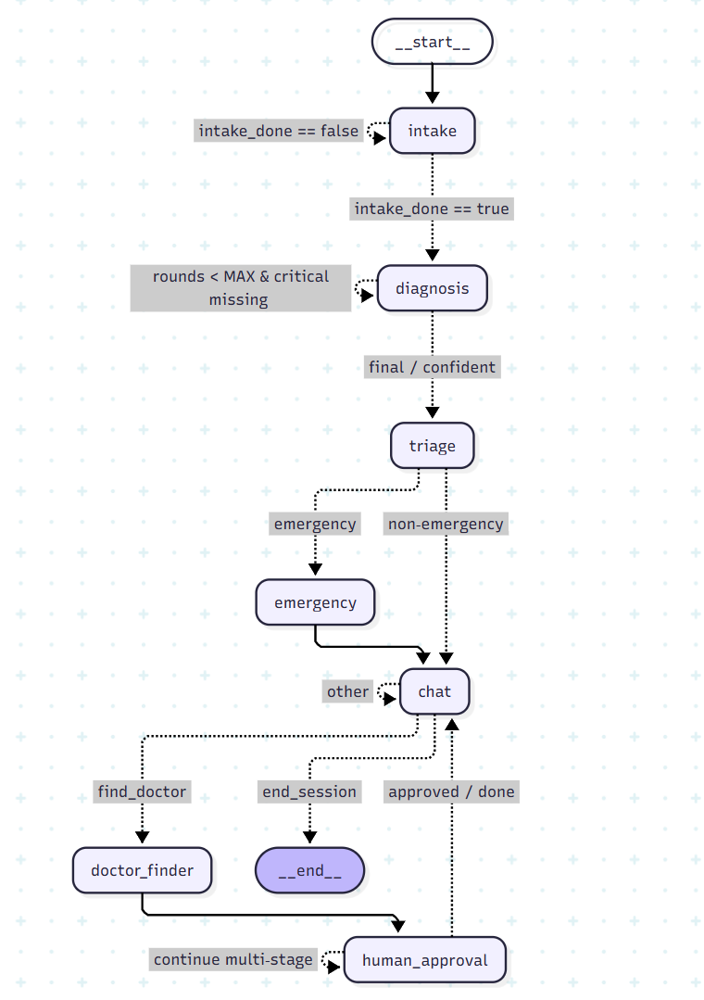
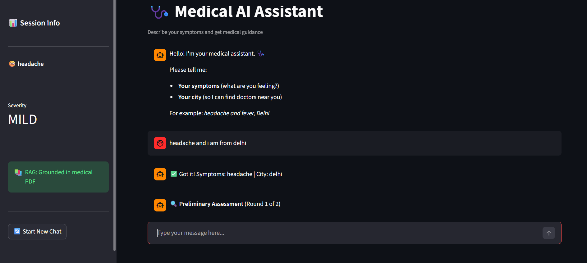

<div align="center">

# 🩺 Medical AI Assistant

### A multi-agent medical chatbot powered by Groq LLM, RAG, and Streamlit

[](https://python.org)
[](https://streamlit.io)
[](https://console.groq.com)
[](https://faiss.ai)
[](https://huggingface.co)
[](https://medical-ai-diagnose.streamlit.app/)

<br/>

### 🌐 [Try the Live App → medical-ai-diagnose.streamlit.app](https://medical-ai-diagnose.streamlit.app/)

<br/>

> ⚠️ **Disclaimer:** This project is a **demonstration only** and is **not a medical device**. Always consult a qualified healthcare professional for real medical advice.

</div>

---

## 📖 Table of Contents

- [Overview](#-overview)
- [Features](#-features)
- [Architecture](#%EF%B8%8F-architecture)
- [Project Structure](#-project-structure)
- [Tech Stack](#-tech-stack)
- [Requirements](#-requirements)
- [Setup & Installation](#%EF%B8%8F-setup--installation)
- [Usage](#-usage)
- [UI Preview](#-ui-preview)
- [Customisation](#%EF%B8%8F-customisation)
- [Limitations & Future Work](#-limitations--future-work)
- [Acknowledgements](#-acknowledgements)

---

## 🌟 Overview

**Medical AI Assistant** is a full-stack, multi-agent chatbot that simulates a clinical triage workflow. It collects patient symptoms, retrieves relevant medical knowledge from a PDF, generates a differential diagnosis, assesses urgency, finds real doctors from a local database, and handles appointment booking — all through a natural conversation interface built with Streamlit.

**No installation needed** — try it instantly at [medical-ai-diagnose.streamlit.app](https://medical-ai-diagnose.streamlit.app/)

---

## ✨ Features

| Feature | Description |
|---|---|
| 🗣️ **Intelligent Intake** | Collects symptoms and city; asks clarifying questions when needed |
| 📚 **RAG Pipeline** | 2-stage corrective retrieval from a medical PDF (FAISS + HuggingFace) |
| 🧠 **Diagnosis Agent** | Structured clinical reasoning with Pydantic-typed outputs; up to 2 follow-up rounds |
| 🚨 **Triage Agent** | LLM-powered emergency assessment using full conversation context |
| 🏥 **Doctor Finder** | Maps symptoms to 35 specialties; filters an Excel database by city |
| 📅 **4-Stage Booking** | Select doctor → pick time slot → enter contact details → confirm |
| 📧 **Email Confirmation** | Sends real booking confirmation via Gmail SMTP (mock fallback available) |
| 🆘 **Emergency Handling** | Detailed emergency message with reasoning and city-specific ER instructions |
| 💬 **Free Chat Mode** | Continue the conversation post-booking with full context preserved |
| 🖥️ **Streamlit UI** | Clean, responsive web interface with streaming support |

---

## 🏗️ Architecture

The system is built as a collection of independent **agents**, each responsible for one step of the medical workflow. The **Streamlit UI** orchestrates the flow using a simple phase-based state machine — no compiled graph is invoked at runtime.

All agents share a single `state` dictionary (defined in `state/schema.py`). The UI reads flags from the state to decide which agent to call next.

<br/>



<br/>

```
User Input
    │
    ▼
  INTAKE (symptoms + city)
    │
    ▼
  DIAGNOSIS (differential, may ask follow-up)
    │
    ▼
  TRIAGE (EMERGENCY / URGENT / MODERATE / MILD)
    │
    ▼
  CHAT (free conversation + intent detection)
    │
    ▼
  DOCTOR FINDER (Excel search by specialty + city)
    │
    ▼
  BOOKING (4-stage human-in-the-loop)
```

---

## 📁 Project Structure

```
medical-ai-assistant/
├── agents/                   # AI agents — each is an independent Python module
│   ├── __init__.py
│   ├── intake.py             # Collects symptoms + city (Pydantic extraction)
│   ├── rag_pdf.py            # PDF ingestion, FAISS index, 2-stage retrieval
│   ├── diagnosis.py          # Differential diagnosis with follow-up loop
│   ├── triage.py             # Severity assessment (full conversation context)
│   ├── chat.py               # Post-diagnosis conversation & intent detection
│   ├── doctor_finder.py      # Excel doctor lookup & speciality mapping
│   ├── booking.py            # 4-stage appointment booking
│   └── emergency.py          # Emergency warning message generator
│
├── state/
│   ├── __init__.py
│   └── schema.py             # BotState TypedDict — shared across all agents
│
├── tools/
│   ├── __init__.py
│   ├── booking_db.py         # SQLite database for appointments
│   ├── email_tool.py         # Gmail SMTP sender (mock fallback)
│   └── time_utils.py         # Day/time parsing for booking
│
├── ui/
│   └── app.py                # Streamlit app — phase-based orchestration
│
├── data/
│   ├── diseases.pdf          # Medical reference textbook
│   └── doctors.xlsx          # Doctor database (35 specialties, 5 cities)
│
├── requirements.txt
├── .env.example
└── README.md
```

---

## 🧪 Tech Stack

| Layer | Technology |
|---|---|
| **LLM** | Groq — LLaMA 3.3 70B |
| **Orchestration** | Streamlit phase-based state machine |
| **RAG** | FAISS + HuggingFace Embeddings |
| **PDF Parsing** | PyPDF |
| **Doctor Database** | Pandas (Excel / `.xlsx`) |
| **Booking Storage** | SQLite |
| **Email** | SMTP — Gmail |
| **UI** | Streamlit |
| **Structured Outputs** | Pydantic |

---

## 📋 Requirements

### Python Version
Python **3.10 or higher** is required.

### Python Packages

Install all dependencies with:
```bash
pip install -r requirements.txt
```

The full list of required packages:

```txt
streamlit
langchain
langchain-core
langchain-groq
langchain-community
langchain-huggingface
langchain-text-splitters
faiss-cpu
sentence-transformers
pypdf
pandas
openpyxl
pydantic
python-dotenv
```

### API Keys Required

| Key | Where to get it | Required? |
|---|---|---|
| `GROQ_API_KEY` | [console.groq.com](https://console.groq.com) — free tier available | ✅ Required |
| `GMAIL_ADDRESS` | Your Gmail address | ⚙️ Optional (for email confirmations) |
| `GMAIL_APP_PASSWORD` | [myaccount.google.com/apppasswords](https://myaccount.google.com/apppasswords) | ⚙️ Optional (for email confirmations) |

> If Gmail credentials are not provided, the app falls back to **mock email mode** and still works fully.

### Data Files Required

| File | Path | Description |
|---|---|---|
| Medical PDF | `data/diseases.pdf` | Medical reference textbook for RAG retrieval |
| Doctor Database | `data/doctors.xlsx` | Excel file with doctor records (see format below) |

---

## ⚙️ Setup & Installation

### 1. Clone the repository

```bash
git clone https://github.com/harsimar-singh03/medical-ai-assistant.git
cd medical-ai-assistant
```

### 2. Create a virtual environment

```bash
python -m venv venv

# Linux / macOS
source venv/bin/activate

# Windows
venv\Scripts\activate
```

### 3. Install dependencies

```bash
pip install -r requirements.txt
```

### 4. Configure environment variables

Copy `.env.example` to `.env` and fill in your credentials:

```ini
GROQ_API_KEY=your_groq_api_key

# Optional — required only for email confirmations
GMAIL_ADDRESS=your_email@gmail.com
GMAIL_APP_PASSWORD=your_app_password
```

### 5. Add your data files

- Place your medical reference PDF as `data/diseases.pdf`
- Place your doctor Excel file as `data/doctors.xlsx` — see the format below

#### `doctors.xlsx` Column Format

| Column | Example |
|---|---|
| Name | Dr. Rajesh Sharma |
| Speciality | Cardiologist |
| Address | 123 Link Road, Andheri |
| Phone Number | +91-9876543210 |
| Rating | 4.5 |
| City | Mumbai |
| Area | Andheri West |
| Experience (Years) | 15 |
| Consultation Fee (₹) | 800 |
| Available Days | Mon, Wed, Fri |
| Available Hours | 10:00 AM – 2:00 PM |
| Clinic Name | Heart Care Clinic |

> Supports complex day patterns like `Mon–Fri` and `Mon–Sat (except Wed)`.

### 6. Run the app

```bash
streamlit run ui/app.py
```


---

## 🚀 Usage

1. Click **"Start Consultation"**
2. Describe your symptoms and city — e.g., *"headache and fever in Delhi"*
3. The bot runs an initial diagnosis. If more information is needed, it will ask one clarifying question (max 2 rounds)
4. The **Triage** result is shown — if it's an emergency, a detailed warning with ER instructions appears
5. In free-chat mode, ask follow-up questions, then say **"find doctor"** to search for a specialist
6. Select a doctor by number, choose a valid day and time slot, enter your contact info, and confirm
7. A booking confirmation email is sent (or mocked if SMTP is not configured)

---

## 🖼️ UI Preview



---

## 🛠️ Customisation

| What to change | Where to change it |
|---|---|
| Symptom → speciality mapping | `SPECIALITY_MAP` in `agents/doctor_finder.py` |
| Red flag keywords | `RED_FLAGS` in `agents/triage.py` |
| Max diagnosis follow-up rounds | `MAX_DIAGNOSIS_ROUNDS` in `agents/diagnosis.py` |
| Add more cities | Expand `data/doctors.xlsx` |

---

## ⚠️ Limitations & Future Work

### Current Limitations

- **Not a medical device** — for demonstration purposes only; always consult a qualified doctor
- RAG quality depends on the medical PDF provided; incomplete sources may affect accuracy
- Doctor availability is static (Excel file); no real-time slot checking

### Planned Improvements

- [ ] Real-time doctor availability via Google Calendar or Practo API
- [ ] SMS appointment reminders via Twilio
- [ ] Persistent user memory — returning users skip intake
- [ ] Multi-language support
- [ ] Hosted demo with live doctor search

---

##  Acknowledgements

- [Groq](https://groq.com) — fast LLM inference
- [Streamlit](https://streamlit.io) — web UI framework
- [FAISS by Meta](https://faiss.ai) — vector similarity search
- [HuggingFace](https://huggingface.co) — sentence embeddings
- [LangChain](https://langchain.com) — agent utilities

---

<div align="center">

Made with ❤️ for better healthcare accessibility

**[🌐 Try Live App](https://medical-ai-diagnose.streamlit.app/)**

</div>
